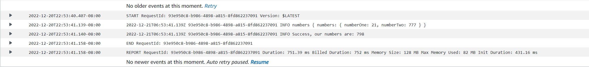

# aws-lambda

The intent for today was to gets3 working, which I have gotten a proof of life after following the demo, my numbers are 21, and 777.  I was able to get them working by following this link. number one is 21 and number two is 777.

I was able to get this message from lambda.  It successfully read my numbers 21, and 777. It also return the intedned 798, although my success message is a bit off.  "Our numbers are: 798", that was totally user error.  However in the future I will keep in mind how this operated and if I am making an add function I would say "Our numbers equal: [insert intended sum here]".

